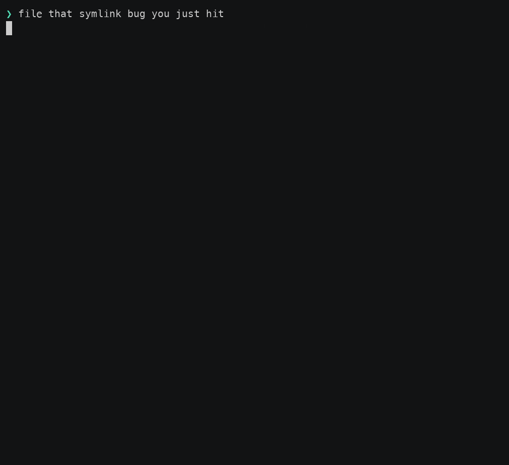
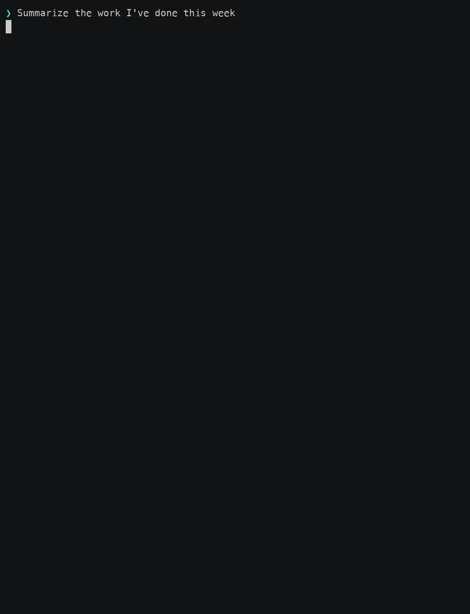
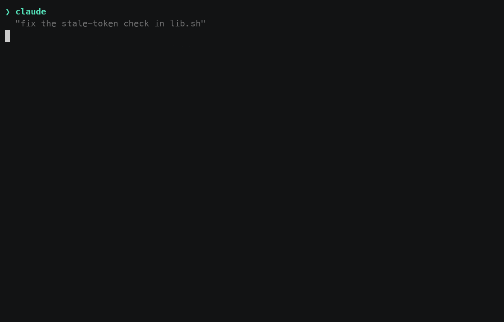

# claude-plugins

A Claude Code plugin marketplace, published as `dnbg`. It makes an agent session
work the way a careful colleague would: every change goes through a worktree and
a draft PR, issues are written to survive a cold handoff, and an independent bot
identity reviews the result before a human merges it.

It is **skills** (loaded on demand when they match the task), a short
**always-on rules** file, and two **enforcement hooks** that make the worktree
and issue flows non-optional in the repos you choose. Two of those are things a
`CLAUDE.md` structurally cannot do: hooks that *enforce* the flow rather than
advising it, and an identity separate from yours that can post a binding verdict
on a PR you wrote.

## What it looks like

**Two sessions on one issue — one resolving it, one reviewing it.** The reviewer
is assigned before any PR exists, so it waits; it sees the draft appear and
holds back, because a draft is the author's signal that the work isn't ready for
anyone's attention yet; it starts the moment the PR is marked ready.


**No issue? Same workflow.** Here the operator works something out
conversationally and it goes straight to a PR. The draft is what makes that
comfortable — every iteration lands on a PR nobody is reviewing yet, so the
reviewer session stays quiet until it's asked for. It ends the way the flow
always ends: the author hands over the merge command, you merge it yourself
(here with `!` in the session), and the worktree and branch are cleaned up
without being asked.


**Filing an issue**, which the gate makes non-optional — an issue written
without the skill is a body the next session can't work from.



**Turning a week of merged PRs into a recap**, shaped by who's going to read it —
condensed from a real session, down to the operator asking for two registers at
once and the caveat the recap carries into both.



> These four are **reenactments**. The parts worth showing — a skill deciding
> something, a picker, an agent explaining why it diverged from an issue — are
> Claude Code's own interface and never reach stdout, so no recorder can capture
> them. The dialogue is scripted to match what the skills actually specify; where
> a demo shows command output it is the real thing, and the `BLOCKED` message in
> the issue-filing one is produced live by the real hook at record time. The scripts
> are in [`docs/media/`](docs/media/) and the gate demo further down is a
> genuine capture.

**You can answer those pickers in advance.** They exist so you decide when work
goes to review and how feedback gets handled — not so you have to be at the
keyboard. Pre-authorizing them in the prompt works:

> I'll be afk — resolve `<issue URL>`, send it to review when you're done, and
> auto-handle any reviewer feedback, then summarize everything that happened.

That pre-answers the send-to-review picker and opts into auto-handling every
round, so the session claims the issue, opens the PR, marks it ready, and works
each review round to a clean verdict while you're away. The one thing it will
not do is merge: only a human merges.

## Why it compounds

Each of these practices is worth something alone. What makes them worth more
together is that the output of one step is the reliable *input* of the next — so
the workflow gets cheaper and safer the longer it runs, instead of accruing
process debt.

**A well-written issue is the cheapest thing you can do for your future self.**
Anchors are verified against the tree when the issue is written, not recalled —
so at pickup the freshness probe is existence-checking rather than re-research.
Cross-references are split into *required reading* and *do not read unless
blocked*, with a hard depth-1 crawl cap, so resolving an issue costs a read
instead of a link crawl. References are phrased to hold in every future state
("while X exists", not "until X lands"), so no maintenance sweep is ever owed.
And acceptance criteria go in whichever issue can actually *run* them — which is
what later lets the reviewer grade the work against the issue, not just the diff.

**You find out early when it's going the wrong way.** The issue gets a critical
review before any code is written — misdiagnosis, symptom-versus-cause, false
premise — and a resolver who has to design the approach itself gets your sign-off
before implementing. Anything that departs from the agreed design mid-flight is
surfaced in chat *before* the PR leaves draft. The expensive failure was never a
wrong PR; it's a wrong PR discovered after the review and the rework are already
paid for.

**The PR description is the as-built record, so everything downstream reads it
instead of the code.** It's written for what the change *is*, not how it was
developed, with the gaps and unverified branches stated rather than omitted. That
makes a work recap a matter of reading descriptions rather than diffs — and
re-asking for a different audience re-shapes what was already gathered instead of
re-fetching it.

**Parallel sessions don't collide.** Claiming an issue leaves marks another
worker can see — including agents, bots, and teammates' tooling this project has
never heard of — and a reviewer deliberately withholds the same marks so they
keep meaning *someone is implementing this*. You can run several sessions at once
without them stepping on each other.

**The system learns instead of relearning.** A reviewer's finding is answered
with the most durable artifact available — a test beats the code, which beats
prose — so each round leaves a guard behind rather than a thread nobody re-reads.
Bugs recurring round after round are themselves treated as a finding, a signal to
name the structural problem instead of patching symptoms. And when the shipped
tooling doesn't fit your case, the agent is told to finish your task and then
*tell you*, offering to file it upstream, rather than silently working around it.

**Token cost falls out of the same design** rather than being optimised in
afterwards. Skills load only when their description matches the task, and the
always-on file — the one thing charged to every session of every user — is kept
short on purpose. Waiting is done by blocking shell watchers running as
background tasks, so idle polling never enters the conversation and a PR that
takes an hour to review costs one wake-up, not sixty; the poll curve backs off
and counts laptop-open time, so a closed lid doesn't burn the window. A
re-review diffs against the last-reviewed SHA rather than re-reading the whole
change. And the reviewer reads CI's results instead of re-running the suite —
primarily because a local run reproduces the *author's* environment rather than
CI's, so every green run argues "flaky, ignore it"; being cheaper is the second
effect, not the reason.

**None of this is theory.** The workflow has been exercised across **more than
1,200 pull requests in 25 repositories** and refined continuously against what
actually broke — the sharper rules in these skills are mostly there because
something went wrong once and the fix got written down instead of forgotten.

## What's in it

| Skill | Plugin | Forge | For |
| --- | --- | --- | --- |
| `git-workflow` | `dnbg-workflow` | GitHub only | Worktree → draft PR → review → merge → cleanup, end to end |
| `issue-workflow` | `dnbg-workflow` | GitHub only | Writing issues that survive a cold handoff; claiming and resolving one |
| `reviewer` | `dnbg-workflow` | GitHub only | Reviewing a pushed PR under an independent GitHub App identity |
| `reviewer-setup` | `dnbg-workflow` | GitHub only | One-time creation of that App (no cloud service, no shared secret) |
| `velocity-tradeoff` | `dnbg-workflow` | **Any** | Opt-in: how to size work where the risk/benefit trade favors speed |
| `coding-practices` | `dnbg-practices` | **Any** | Design, security, naming, logging, and the smells to stop on |
| `work-summary` | `dnbg-work-summary` | GitHub only | Turning your merged/open PRs into an audience-shaped recap |

The `reviewer` pair is the piece with the least in common with the rest — it
exists because GitHub won't let you approve your own PR, and a separate App
identity can. `reviewer-setup` creates that App and keeps its private key on
your machine.

## Install

```
/plugin marketplace add dbaggott/claude-plugins
```

Then, as a separate command — the install can't run until the marketplace add
completes, and pasting both at once only registers the first as a slash command:

```
/plugin install dnbg-all@dnbg
```

`dnbg-all` installs all three. To take only part of it, install what you want
instead — they are independent, and none requires another:

| Plugin | What you get |
| --- | --- |
| `dnbg-workflow@dnbg` | The GitHub workflow, its two enforcement hooks, and the reviewer bot. GitHub, except `velocity-tradeoff` |
| `dnbg-practices@dnbg` | Coding practices. No hooks, no forge, works anywhere |
| `dnbg-work-summary@dnbg` | PR recaps. No hooks. GitHub |

**The plugin is the unit you can enable or disable** — there is no per-skill
switch. So what you can adopt on its own is decided by how this project packages
itself, and the table above is that split: each row installs independently, and
anything sharing a row arrives together.

> Three names, deliberately different. The **repo** is `claude-plugins`, a
> **plugin** is e.g. `dnbg-workflow`, and the **marketplace** is `dnbg` — hence
> `dnbg-workflow@dnbg`. Claude Code rejects marketplace names containing
> "claude" as impersonating an Anthropic-official marketplace, which is why the
> marketplace needed a name of its own.

Nothing is enforced until you say where: the hooks block only in repos whose
owner you list in `owners`, and with it empty they never fire. That setting, the
install scopes, and two configurable names are in
[configuration](docs/configuration.md). Requirements — a Claude Code floor and
six command-line tools — are in [requirements](docs/requirements.md).

## Which forges

**GitHub is supported.** GitLab and Bitbucket are
[planned](https://github.com/dbaggott/claude-plugins/issues/21); everything else
is unsupported. The forge-neutral skills — `coding-practices` and
`velocity-tradeoff` — work anywhere regardless.

On an unsupported forge a coupled skill **declines and says so**, naming the host
it found, rather than half-translating itself to another CLI. The per-forge
matrix, what each skill checks, and why the coupling isn't papering-over-able are
in [forge support](docs/forge-support.md).

## What it runs on your machine

Installing `dnbg-workflow` means **it runs shell scripts on your machine** —
that is what a Claude Code hook is. Four of them fire automatically once the
marketplace is trusted: two inject the always-on rules (at session start, and
again per subagent, because session-start output does not reach subagents), and
two are the gates that block edits outside a worktree and unguarded
`gh issue create` calls.



Unlike the four above, that one is a genuine capture: real output from
`check-worktree.sh`, from `git`, and from the GitHub API.

They make **no network calls**, write no files, and hold no credentials, and
**nothing here updates itself** — what you install is what runs until you update
it deliberately, so reading
[`dnbg-workflow/hooks/`](dnbg-workflow/hooks/) once is a review that stays valid.

[`SECURITY.md`](SECURITY.md) is the full account: what each hook sees, the one
place a transcript is read and why, what the reviewer bot's key can do, and why
the gates are workflow guardrails rather than a security boundary.

## Who maintains it

This repo is maintained by Dan Baggott.

Bug reports, portability findings, tests for untested branches, and
documentation corrections are all welcome. So are new **knobs** that leave the
current behavior as the default. Swapping one default for another is not:
worktree-then-draft-PR, never merging your own work, and fragments-drive-releases
are the product rather than incidental choices. [`CONTRIBUTING.md`](CONTRIBUTING.md)
has the detail, and an issue first is always cheaper than a declined PR.

## Documentation

| | |
| --- | --- |
| [Requirements](docs/requirements.md) | Claude Code floor, the six CLI tools, platforms |
| [Configuration](docs/configuration.md) | Install scopes, `owners`, the two configurable names, the reviewer key |
| [Forge support](docs/forge-support.md) | Per-forge matrix, and what declining looks like |
| [Releases](docs/releases.md) | Updating, auto-update, CalVer, installing a specific version |
| [Security](SECURITY.md) | Threat model, what the hooks see, reporting a vulnerability |
| [Contributing](CONTRIBUTING.md) | Scope, the fragment rule, running CI locally |
| [For maintainers](docs/maintainers.md) | Repo layout, where new content goes, forks, regenerating the demo |

## License

[Apache-2.0](LICENSE).
